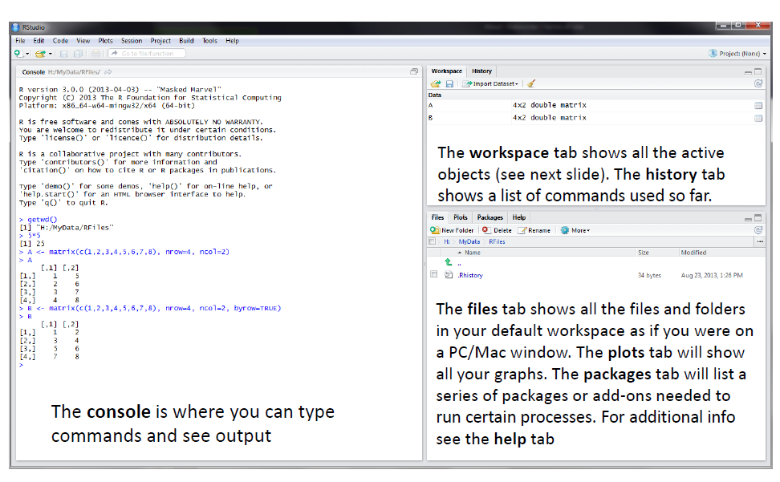
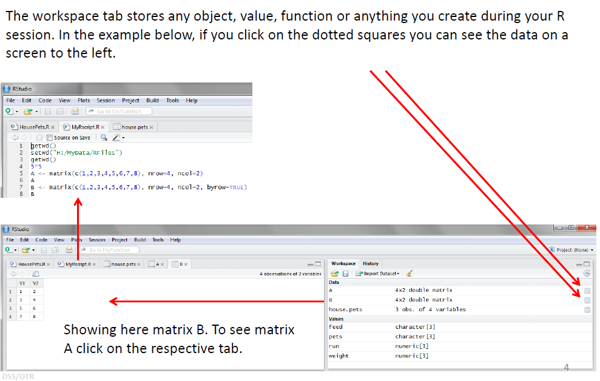
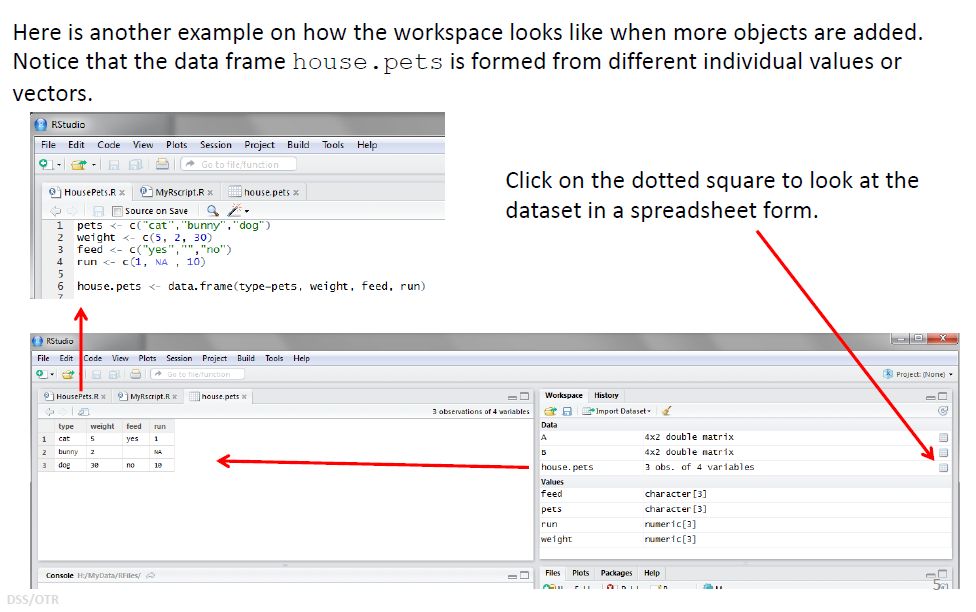
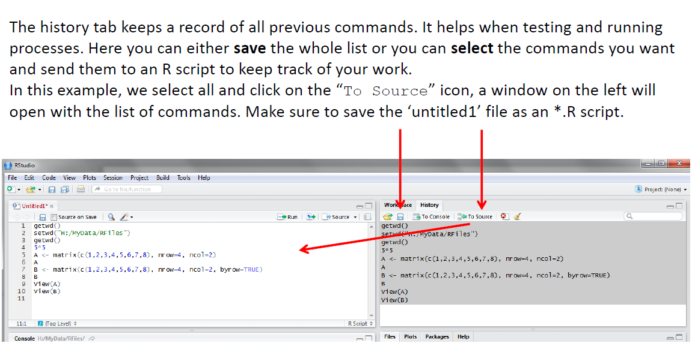
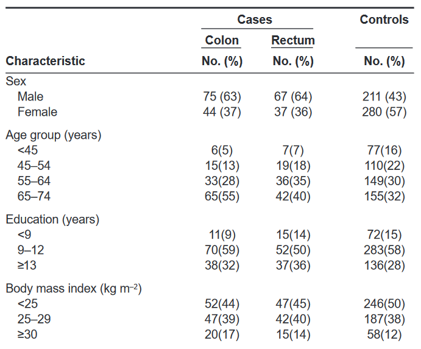
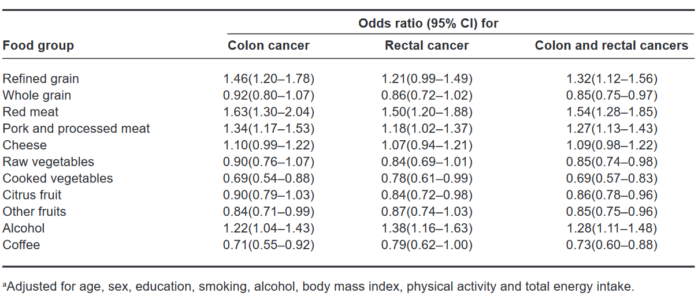
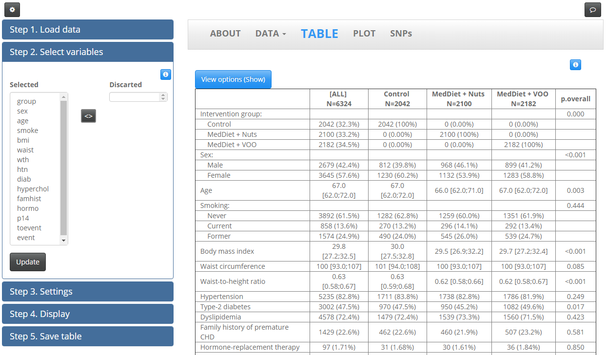

```{r setup, include=FALSE}
knitr::opts_chunk$set(echo = TRUE,comment="", message=FALSE, warning=FALSE, cache=TRUE)
options(width=80)
```

# RStudio

## RStudio screen




## Worspace tab (1)




## Workspace tab (2)




## History tab




# Getting data into R - import data

## Required packages

- \color{blue}`foreign`\color{black}: ~ import/export from SPSS, STATA, SAS,...

- \color{blue}`RODBC`\color{black}: ~ SQL or ACCESS data bases.

- \color{blue}`Hmisc`\color{black}: ~ SPSS, Hmisc (64bits).

- \color{blue}`readxl`\color{black}: ~ export/import Excel files. 

```{r}
library(foreign)
library(Hmisc)
library(readxl)
```


## ASCII files

- `sep`: column/variable separator character
- `header`: first row contains variable names?
- `as.is`: convert character to factor variables?


```{r}
df<-read.table("data/parto2.dat", sep=";", as.is=TRUE, header=FALSE)
head(df)
```

## Excel

Use `read_excel` from `readxl` package.

```{r}
df<-read_excel("data/mujeres.xlsx")
class(df)
class(df) <- "data.frame"
head(df)
```


## Stata

- To read Stata files (.dta), use `read.dta` function from `foreign` package

```{r}
df <- read.dta("data/partoFin.dta",
             convert.dates = TRUE, convert.factors = TRUE)
head(df)
```

- Stata version >12 are not supported. You can use `readstata13`

```{r, eval=FALSE}
library(readstata13)
df <- read.dta13("data/partoFin.dta",
             convert.dates = TRUE, convert.factors = TRUE)
````


## SPSS

- To read SPSS (.sav) files, use `spss.get` function from `Hmisc` package.

- `use.value.labels`: return the label instead of codes.

- `datevars`: specify date format variables.

```{r}
df <- spss.get("data/parto2.sav",use.value.labels=TRUE, allow="_", 
             datevars=c("dia_nac","dia_entr","ulti_lac"))
head(df)
```


# Export data

## ASCII, Excel, Stata

- ASCII file

```{r, eval=FALSE}
write.table(df,"parto2ex.dat")
```

- Stata

```{r, eval=FALSE}
write.dta(df, file="c:/juan/data/bd.dta"), version=7L)
save.dta13(df, file="c:/juan/data/bd.dta")
```

- Objects

Save:
```{r, eval=FALSE}
save(df, file="c:/juan/data/bd.Rdata")) # or .rda
```

Load:
```{r, eval=FALSE}
load("c:/juan/data/bd.Rdata")) # an object df will be in R
```


# R basics

## Read the data


- Read the data from a SPSS data file
- `Hmisc` package is required

```{r}
library(Hmisc)
df <- spss.get("data/partoFin.sav", allow="_", 
               datevars=c("dia_nac", "dia_entr", "ulti_lac"))
```

Take a look at first rows

```{r}
head(df)
```

## Explore data

- How many rows and variables

```{r}
nrow(df)
ncol(df)
```

- View names

```{r}
names(df)
```

---

- Summary of all variables

```{r}
summary(df)
```

## Select variables

- Select a variable by its name

```{r}
df$sexo
```

- Select a variable by its position

```{r}
df[,2]
```


---

- Select some variables by names

```{r}
df[,c("sexo", "peso", "edad")]
```

---

- Select some variables by position

```{r}
df[,c(1,3,5)]
```

## Select rows

- Select a row

```{r}
df[4,]
```
- Select rows

```{r}
df[4:10,]
```

---

- Select rows by a condition, use `subset`

```{r}
subset(df, sexo=="niña")
```


---

- More than one category

```{r}
table(df$naci_ca)
subset(df, naci_ca%in%c("Española", "Otras"))
```       


## Descriptives

- Mean

```{r}
mean(df$edad)
```

- Standard deviation

```{r}
sd(df$edad)
```

- Median

```{r}
median(df$edad)
```

---

- Percentiles

```{r}
quantile(df$edad, c(0.25, 0.50, 0.75))
```


- Pearson correlation

```{r}
with(df, cor(peso, edad))
```     
     
- Spearman correlation

```{r}
with(df, cor(peso, edad, method="spearman"))
``` 

## Plots

- Histogram

```{r}
hist(df$peso)
```

---

- Barplot

_Note: The variable must be a factor o a character. If it is numeric (e.g. 0, 1) convert to a factor using `as.factor`._

```{r}
plot(df$sexo)
```

---

- Boxplot (I)

```{r}
boxplot(df$peso, ylab="Peso (kgs.)")
```

---

- Boxplot (II)

```{r}
boxplot(peso ~ sexo , data=df, col="red", 
        ylab="Peso (kgs.)", xlab="Sexo")
```

---

- Scatterplot


```{r}
plot(peso ~ edad, data=df, col=sexo, pch=19)
title("Weight by mother age")
legend("topright", c("boy","girl"), fill=c(1,2))
```

## Tests

- One sample test

```{r}
t.test(df$peso, mu=4)
```

---

- Two independent sample test

\vspace{-0.3cm}

```{r}
t.test(peso ~ sexo, data=df)
```

- Paired t-test

\vspace{-0.3cm}

```{r}
t.test(df$horas_an, df$horas_de, paired = TRUE)
```

---

- Two proportions test

```{r}
freq <- with(df, table(sexo, tip_par))
fisher.test(freq)
```

---

- Pearson correlation test

\vspace{-0.2cm}

```{r}
cor.test(df$peso, df$edad)
```

- Spearman correlation test

\vspace{-0.2cm}

```{r}
cor.test(df$peso, df$edad, method="spearman")
```


## Models

- Linear regression.

```{r}
model <- lm(peso ~ edad, data=df)
summary(model)
```

---

- Logistic regression: predict type of treatment by mother age. 


```{r}
model <- glm(tip_par ~ edad, data=df, family="binomial")
summary(model)
```

Note: `Estimate` are the log-OR, or the coefficients

## Scripting

Normally each execution is stored in an object and it is passed to the next core. For instance, let us assume we are interested in predicting the type of treatment by mother age only for those who received intensive treatment

```{r, scripting}
sel <- df$tx=="Intensivo"
sel[1:6]
df.intensive <- df[sel,]
model.int <- glm(tip_par ~ edad, data=df.intensive, 
                 family="binomial")
summary(model.int)
```

## Dealing with multiple tables

- The simplest way of managing multiple table are lists

```{r}
load("data/russett.Rdata")
head(X_agric)
head(X_ind)
```

---

```{r}
head(X_polit)
X <- list(tab1 = X_agric, tab2 = X_ind, tab3 = X_polit)
length(X)
head(X[[1]])
```

## and more ...

- Creating functions
- Loops
- Parallel computing
- Create new packages
- Create new types of data (e.g. omic)
- ...


# R facilitates data description and reproducible research

- Baseline description




---

- Patients characteristics comparision


---

- Odds ratio estimation


## compareGroups

`compareGroups` is an R package available on CRAN to create descriptive tables

It consists of three key funcions:

1. \color{blue}`compareGroups`\color{black} ~ generates all the calculation

2. \color{blue}`createTable`\color{black} ~ creates the descriptive table obtained by `compareGroups`. You can costumize it by excluding categories, number of decimals, etc.

3. \color{blue}`export2...`\color{black} ~ exports the descriptive table obtained by `createTable` to EXCEL, Word, LaTeX, Rmarkdown, etc.


## Example

**PREDIMED project:** \url{http://www.cat.isciii.es/ISCIII/es/contenidos/fd-el-instituto/fd-comunicacion/fd-noticias/PREDIMED-2013.pdf}

1. Load the package and the example data existing in `compareGroups` package

```{r, results="hide"}
library(compareGroups)
data(predimed)
# ?predimed
```

```{r}
head(predimed)
```

---

2. Compute descriptives and other figures by treatment group

- Use of formula environment to select variables.

- On left hand side write the variable indicating groups (nothing indicates that descriptive analyses will be performed for the whole database). 

- On the right side write all the variables you want to describe by the grouping variable 


```{r}
descr <- compareGroups(group ~ sex + age + smoke, predimed)
descr
```

---

- If you are interested in describing all variables use '.'

```{r}
descr <- compareGroups(group ~ ., predimed)
descr
```

---

- If you are inerested in describing all variables but a subset of them use '-' (this is useful when having variables such us 'id', 'hc', 'name', ...)


```{r}
descr2 <- compareGroups(group ~ . -sex -age -event, predimed)
descr2
```


---

3. Build the descriptive table. 


```{r}
descrtable <- createTable(descr)
descrtable
```

## Customizing results

- Hide 'No' category

```{r}
update(descrtable, hide.no='no')
```
---

- Show number of valid data

```{r}
update(descrtable, hide.no='no', show.n = TRUE)
```

---

- Show only relative percentages

```{r}
update(descrtable, hide.no='no', show.n = TRUE, type=1)
```

## Customizing descriptives (tests)

- By default, `compareGroups` report means and SD, and performs t-test or ANOVA for continous variables.

- To report medians and quartiles and perform Kruskall-Wallis tests for continuous variable:

```{r}
descr <- update(descr, method=2)
createTable(descr, hide.no="no")
```

---

- Change number of decimals

```{r}
update(descrtable, hide.no='no', digits=1, digits.p=5)
```


---

- Perform medians and quantiles for some variables:

```{r}
descr <- update(descr, method=c(age=2, p14=2))
createTable(descr, hide.no="no")
```


## Odds Ratio


- Place the case/control variable on left hand side. 

- It computes the Odds Ratio (OR) of being a case (second category). To change reference category, use `ref.y` argument from `compareGroups` function.

- Let's report the OR of being hyperchol

```{r}
table(predimed$hyperchol)
```

---

```{r}
descr <- compareGroups(hyperchol ~ ., predimed)
createTable(descr, hide.no="no", show.ratio=TRUE, 
            show.p.overall=FALSE, show.p.trend = FALSE)
```


## Hazard Ratios

- PREDIMED is a cohort study with time-to-event outcome.

- Descriptives by cases and controls, HR taking into account time-to-event response (with possible right censoring) and  and p-values are easily computed


---

1. First, create a `Surv` variable

```{r}
predimed$tevent <- with(predimed, Surv(toevent, event=="Yes"))
```

2. Then write this variable on left side of `~` in `compareGroups`.
Note the use of `-` to erase some variables.

```{r}
descr <- compareGroups(tevent ~ .- toevent-event, predimed)
createTable(descr, hide.no="no", show.ratio=TRUE, 
            show.p.overall=FALSE)
```

## Utilities

- use `label` function from Hmisc package to label variables

```{r}
label(predimed$age) <- "Age of participant"
```

- To know the original variable names (instead of labels)

```{r}
descrtable <- createTable(compareGroups(group ~ ., predimed))
varinfo(descrtable)
```

---

- To select some variables use `[]`, indexing by names or by position

```{r}
descrtable <- createTable(compareGroups(group ~ ., predimed))
descrtable[c('age','bmi')]
descrtable[c(1,4)]
```


## Plotting variables

- Continuous univariate

```{r}
descr <- compareGroups(group ~ ., predimed)
plot(descr['bmi'])
```

---

- Continuous by groups

```{r}
plot(descr['bmi'], bivar=TRUE)
```

---

- Categorical variable

```{r}
plot(descr['sex'])
```


---

- Categorical by groups

```{r}
plot(descr['sex'], bivar=TRUE)
```

## Export

```{r, eval=FALSE}
# CSV
export2csv(descrtable, file="tabla.csv", sep=";")
# Excel
export2xls(descrtable, file="tabla.xlsx")
# Word
export2word(descrtable, file="tabla.docx")
# Latex
export2tex(descrtable, file="tabla.tex")
```

... or inside a **Rmarkdown** document chunk


```{r}
export2md(descrtable)
```


## More

- There exists much more options

- See `?compareGroups`, `?createTable`, ...

- Visit [compareGroups wepage](http://www.comparegroups.eu/)

- Application made with Shiny available [here](http://apps.datarus.eu/comparegroups/)

---



## Session info

```{r}
sessionInfo()
```

